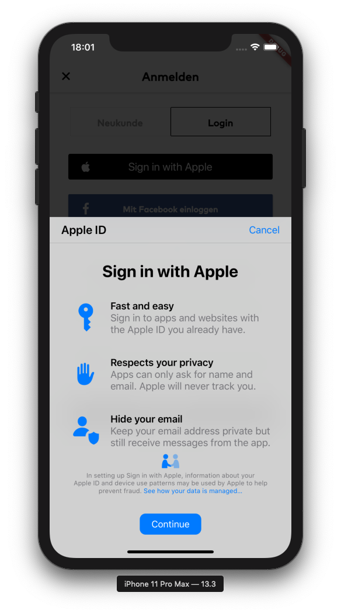

# Sign in With Apple

Flutter bridge to Sign in with Apple.

Supports login via an Apple ID as well as credentials saved in the user's keychain.

## Supported platforms

* iOS
* macOS

## Example Usage

```dart
SignInWithAppleButton(
    onPressed: () async {
        final credentials = await SignInWithApple.requestCredentials();
        
        if (credentials is AuthorizationCredentialAppleID) {
            /// send credentials to your server to create a session
            /// after they have been validated with Apple
        } else if (credentials is AuthorizationCredentialPassword) {
            /// Login the user using username/password combination
        }
    },
);


```

## Flow



